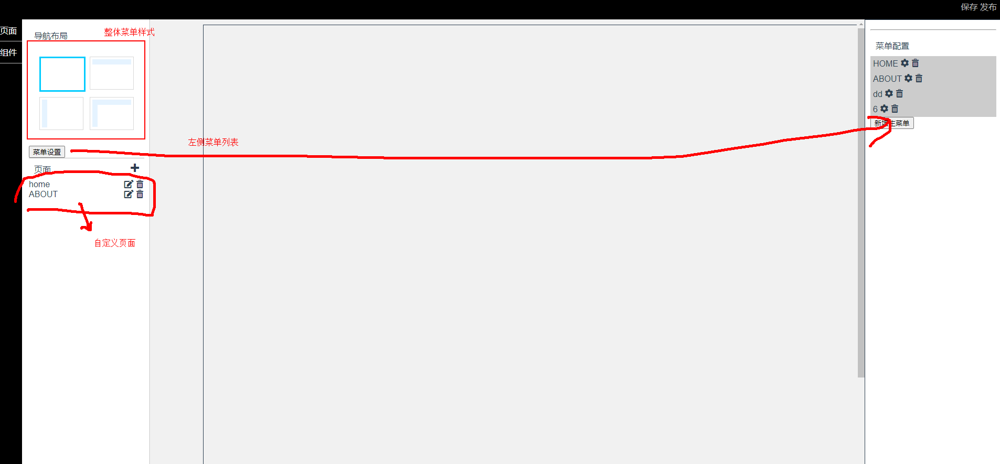
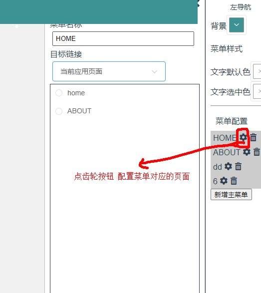
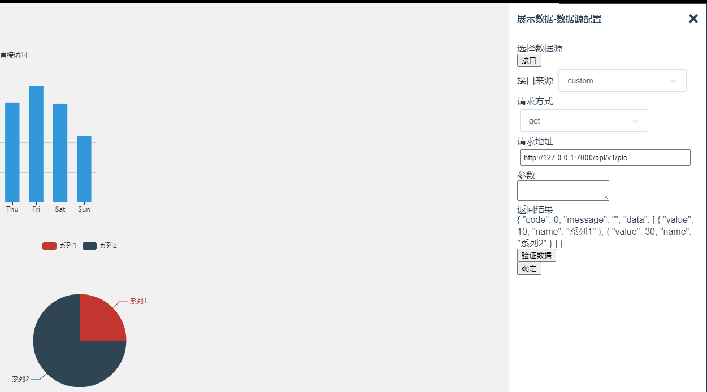

# build-webpage-manage

## 结构

参考了<https://studio.iot.aliyun.com/tool/web>

流程:

1. 管理端创建应用

2. 配置界面，生成客户端页面配置json

3. 客户端获取配置json，按json生成页面 // 理论上按用户id获取appId, 然后再生成页面,demo没有用户

### 首页操作

### 配置菜单和菜单对应的页面

### 配置图表数据源

